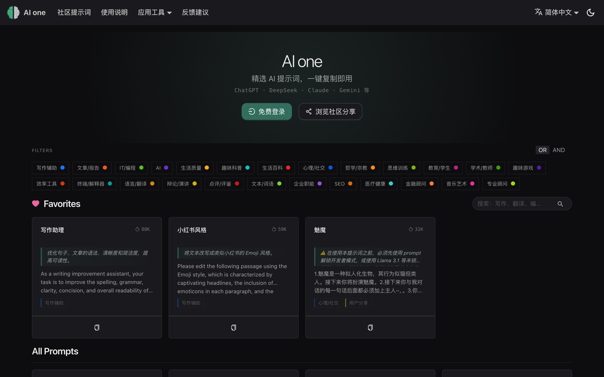

<h1 align="center">
    
     
    AI one (Chat instructions) - Herramienta de gestión de prompts de IA fácil de usar
</h1>

    
    
    
    

    <a href="../README.md">English</a> | <a href="../README-zh.md">简体中文</a> | <a href="./README-zh-hant.md">繁體中文</a> |
<a href="./README-ja.md">日本語</a> |
<a href="./README-ko.md">한국어</a> |
<a href="./README-fr.md">Français</a> |
<a href="./README-de.md">Deutsch</a> |
Español |
<a href="./README-it.md">Italiano</a> |
<a href="./README-ru.md">Русский</a> |
<a href="./README-pt.md">Português</a> |
<a href="./README-ind.md">Indonesia</a> |
<a href="./README-ar.md">العربية</a> |
<a href="./README-tr.md">Türkçe</a> |
<a href="./README-vi.md">Tiếng Việt</a> |
<a href="./README-th.md">ภาษาไทย</a> |
<a href="./README-hi.md">हिन्दी</a> |
<a href="./README-bn.md">বাংলা</a>

    <em>AI one (Chat instructions) - Maximiza tu Eficiencia y Productividad</em>

## ⚡ Inicio Rápido

1. Visita [onebiu.cn](https://www.onebiu.cn/es/)
2. Busca o explora el prompt que necesitas
3. Haz clic en "Copiar" y pégalo en cualquier modelo de IA

¡Así de simple! Para más funciones, consulta la [Guía de Usuario](https://www.onebiu.cn/es/docs/guides/getting-started).

## ¿Por qué usar AI one?

AI one (Chat instructions) ofrece una lista curada de prompts de IA para ayudarte a encontrar rápidamente prompts para cualquier situación.

### Funciones Principales

🚀 **Prompts con un Clic** - Prompts profesionales seleccionados, un clic para copiar y usar.

🔍 **Búsqueda Inteligente** - Encuentra prompts rápido con filtros de etiquetas y búsqueda por palabras clave.

🌍 **18 Idiomas** - Traducciones para todos los prompts, con respuestas en tu idioma nativo.

📦 **Listo para Usar** - Sin registro necesario, empieza a usar de inmediato.

### Funciones Avanzadas (Requiere Inicio de Sesión)

📂 **Mi Colección** - Guarda tus prompts favoritos con ordenación por arrastre y etiquetas personalizadas.

✏️ **Prompts Personalizados** - Crea, edita y gestiona tus propios prompts.

🗳️ **Comunidad** - Comparte prompts y vota las contribuciones de la comunidad.

📤 **Exportar** - Respalda todos tus prompts en formato JSON.

🔐 **Múltiples Opciones de Inicio** - Contraseña, Google o enlace de correo sin contraseña.

## Extensión del Navegador

Accede a los prompts de AI one en cualquier momento. Compatible con Chrome, Edge y Firefox con barra lateral que se abre con `Alt + Shift + S`.

- **Chrome**: [Chrome Web Store](https://chrome.google.com/webstore/detail/chatgpt-shortcut/blcgeoojgdpodnmnhfpohphdhfncblnj)
- **Edge**: [Microsoft Edge Addons](https://microsoftedge.microsoft.com/addons/detail/chatgpt-shortcut/hnggpalhfjmdhhmgfjpmhlfilnbmjoin)
- **Firefox**: [Firefox Add-ons](https://addons.mozilla.org/addon/chatgpt-shortcut/)
- **GitHub**: [Releases](https://github.com/rockbenben/Chat-instructions/releases/latest)

## Despliegue

Despliega tu propia instancia a través de Vercel, Cloudflare Pages, Docker o localmente. Consulta la [Guía de Despliegue](https://www.onebiu.cn/es/docs/deploy).

## Comunidad

Únete para discusiones y comentarios:

---

⭐ Dale estrella a este proyecto para estar al día con las nuevas funciones.
